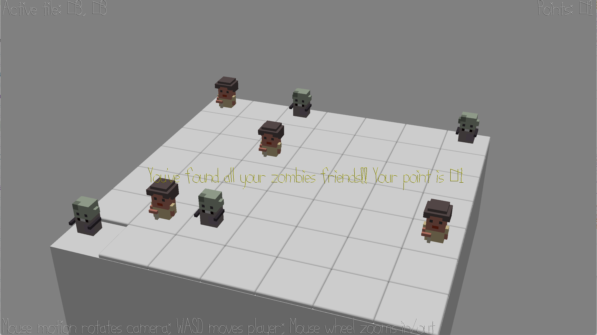

# (TODO: your game's title)

Author: Qingyi Dong, Michelle Chang

Design: A whack-a-zombie game where the player can determine the position of your zombie friends by listening to the location of the banging noise. Beware of humans- they make a different noise.

Screen Shot:

How To Play:

- Move around the grid with WASD
- Move the highlighted tile with arrow keys
- Use the space key to reveal the character enclosed below the highlighted tile
- Points are incremented for every zombie found; points are deducted for every human found and every empty tile attempted.

Sources: 
- [background music] Funshine(https://freepd.com/upbeat.php)
- Voxel characters created with [MagicaVoxel](https://ephtracy.github.io/)

This game was built with [NEST](NEST.md).

